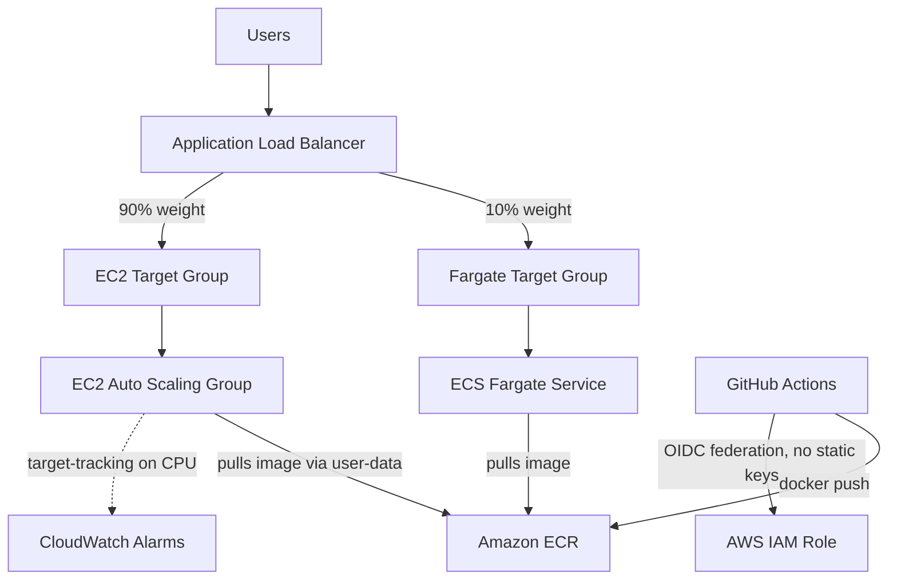

# Payal Creation — Cloud & DevOps Deployment

A containerized Flutter web app deployed on AWS with a fully automated CI/CD pipeline, dual compute paths (EC2 + ECS Fargate) behind a single load balancer, and OIDC-based authentication — no long-lived AWS keys anywhere in the pipeline.

This project was built as a hands-on learning exercise while transitioning from mechatronics engineering into cloud/DevOps, with an emphasis on understanding *why* each piece exists, not just getting it working.

## Architecture

**Request flow:** Users hit the ALB → traffic is split by weight across two target groups → EC2 (primary, 90%) and Fargate (backup/overflow, 10%) both serve the same containerized app, pulled from the same ECR image.

**Deploy flow:** GitHub Actions authenticates to AWS via OIDC (short-lived, per-run credentials — not stored access keys), builds and tests the Flutter app, builds a Docker image, and pushes it to ECR.

**Resilience:** If EC2 capacity drops to zero (or becomes unhealthy), the ALB automatically routes 100% of traffic to the healthy Fargate targets — verified in practice, not just theoretical.

## Tech stack

- **App:** Flutter (web build), Docker
- **CI/CD:** GitHub Actions, OIDC federation to AWS
- **Compute:** EC2 (Auto Scaling Group, custom AMI, Launch Templates), ECS Fargate
- **Networking:** Application Load Balancer, weighted target groups, security groups
- **Registry:** Amazon ECR
- **IAM:** Least-privilege roles — separate roles for GitHub Actions (push), EC2 (pull), and ECS task execution (pull + logging)

## How EC2 self-provisions

New EC2 instances aren't manually configured. The Auto Scaling Group launches instances from a custom AMI (Docker pre-installed) via a Launch Template, and a **user-data script** runs on boot to:
1. Authenticate to ECR using the instance's IAM role
2. Pull the latest image
3. Run the container with `--restart unless-stopped`

This means a freshly launched instance is serving traffic within minutes with zero manual SSH access required.

## How Fargate fits in

ECS Fargate runs the same image as a serverless backup path — no EC2 instances to manage for it. It's registered in its own target group on the same ALB, with weighted routing splitting traffic between the two compute paths. If EC2 has no healthy targets, the ALB's health-check-aware routing naturally shifts all traffic to Fargate with no manual intervention.

## Problems solved along the way

A few real issues hit (and fixed) during the build — documenting these because the debugging was arguably the most valuable part of the project:

- **OIDC trust policy mismatch:** GitHub's newer OIDC token format embeds the actor ID and repository ID directly into the `sub` claim (`repo:owner@actor_id/repo@repo_id:ref:...`) rather than the older plain `owner/repo` format. The IAM trust policy's `StringLike` condition had to be updated to match the actual token shape, found by decoding the token directly in a debug workflow step rather than guessing.
- **IAM permissions vs. trust policy:** Assuming a role (authentication) and having permissions to act (authorization) are separate concerns — `sts:AssumeRoleWithWebIdentity` succeeding doesn't mean the role can do anything. Diagnosed and fixed missing `ecr:GetAuthorizationToken` and repository-scoped push permissions one error at a time.
- **503 from the ALB despite a healthy container:** The EC2 instance launched by the ASG was running the app correctly (confirmed via direct IP and container logs), but was never registered in the target group — the ASG wasn't linked to the target group in its load balancing configuration, so the ALB had no target to route to at all. Fixed by explicitly attaching the target group at the ASG level so future scaling events register/deregister instances automatically.

## Status / roadmap

- [x] Containerized build + CI pipeline to ECR
- [x] OIDC-based authentication (no static AWS keys)
- [x] EC2 Auto Scaling Group with self-provisioning instances
- [x] ECS Fargate backup path with weighted ALB routing
- [x] Verified automatic failover from EC2 to Fargate
- [ ] Full CD automation (ASG instance refresh + ECS force-deployment triggered from CI)
- [ ] Dynamic overflow scaling: CloudWatch alarms + automation to shift traffic to Fargate during EC2 scale-up delay, then rebalance back
